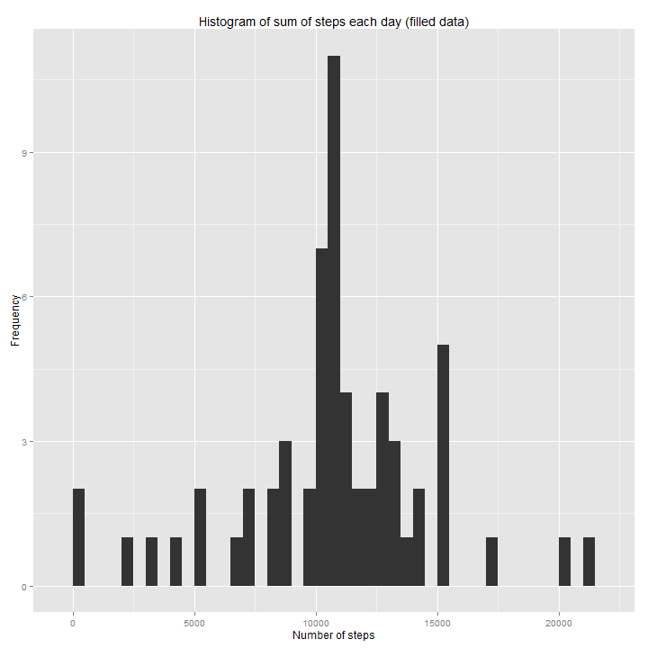

### Loading and preprocessing the data
Loading necessary library:


```r
library(lubridate)
library(plyr)
library(dplyr)
library(ggplot2)
library(knitr)
```

Unzip and loading data from csv file. Column "date" should be recoded to correct class. 


```r
unzip(zipfile="activity.zip")
data <- read.csv("activity.csv", header = TRUE, stringsAsFactors = FALSE)
data$date <- ymd(data$date)
```


### What is mean total number of steps taken per day?
In this section, NA value will be ignored, therefore only complete row will be extract.


```r
valid.index <- !is.na(data$steps)
valid.data <- data[which(valid.index),]
```

Calculate the total number of steps taken per day.


```r
valid.data.date.grouped <- valid.data %>%
                                group_by(date) %>%
                                summarise(sum.steps = sum(steps))
kable(valid.data.date.grouped, caption="Total number of steps taken per day")
```


|date       | sum.steps|
|:----------|---------:|
|2012-10-02 |       126|
|2012-10-03 |     11352|
|2012-10-04 |     12116|
|2012-10-05 |     13294|
|2012-10-06 |     15420|
|2012-10-07 |     11015|
|2012-10-09 |     12811|
|2012-10-10 |      9900|
|2012-10-11 |     10304|
|2012-10-12 |     17382|
|2012-10-13 |     12426|
|2012-10-14 |     15098|
|2012-10-15 |     10139|
|2012-10-16 |     15084|
|2012-10-17 |     13452|
|2012-10-18 |     10056|
|2012-10-19 |     11829|
|2012-10-20 |     10395|
|2012-10-21 |      8821|
|2012-10-22 |     13460|
|2012-10-23 |      8918|
|2012-10-24 |      8355|
|2012-10-25 |      2492|
|2012-10-26 |      6778|
|2012-10-27 |     10119|
|2012-10-28 |     11458|
|2012-10-29 |      5018|
|2012-10-30 |      9819|
|2012-10-31 |     15414|
|2012-11-02 |     10600|
|2012-11-03 |     10571|
|2012-11-05 |     10439|
|2012-11-06 |      8334|
|2012-11-07 |     12883|
|2012-11-08 |      3219|
|2012-11-11 |     12608|
|2012-11-12 |     10765|
|2012-11-13 |      7336|
|2012-11-15 |        41|
|2012-11-16 |      5441|
|2012-11-17 |     14339|
|2012-11-18 |     15110|
|2012-11-19 |      8841|
|2012-11-20 |      4472|
|2012-11-21 |     12787|
|2012-11-22 |     20427|
|2012-11-23 |     21194|
|2012-11-24 |     14478|
|2012-11-25 |     11834|
|2012-11-26 |     11162|
|2012-11-27 |     13646|
|2012-11-28 |     10183|
|2012-11-29 |      7047|

Make a histogram of the total number of steps taken each day


```r
ggplot(valid.data.date.grouped, aes(x=sum.steps)) +
    geom_histogram(binwidth = 500) +
    xlab("Number of steps") + ylab("Frequency") + 
    ggtitle("Histogram of sum of steps each day")
```

 

Mean of the total number of steps taken per day:  


```r
mean(valid.data.date.grouped$sum.steps)
```

```
## [1] 10766.19
```

Median of the total number of steps taken per day: 


```r
median(valid.data.date.grouped$sum.steps)
```

```
## [1] 10765
```

### What is the average daily activity pattern?
Group data by interval 

```r
mean.steps.interval.grouped <- valid.data %>%
                            group_by(interval) %>%
                            summarise(sum.steps = mean(steps))
```

Make a time series plot of the 5-minute interval (x-axis) and the average number of steps taken, averaged across all days (y-axis)


```r
ggplot(mean.steps.interval.grouped, aes(x=interval, y=sum.steps)) +
    geom_line() + ggtitle("Mean of steps by interval") +
    xlab("5-minutes interval") + ylab("Number of steps") + 
    coord_cartesian(xlim = c(0, 2355), )+
    scale_x_continuous(breaks = c(0,400,800,1200,1600,2000,2355))
```

 

Which 5-minute interval, on average across all the days in the dataset, contains the maximum number of steps?


```r
max.steps <- max(mean.steps.interval.grouped$sum.steps)
max.steps.intervals <- mean.steps.interval.grouped[mean.steps.interval.grouped$sum.steps == max.steps,]
max.steps.intervals
```

```
## Source: local data frame [1 x 2]
## 
##   interval sum.steps
## 1      835  206.1698
```

### Imputing missing values
Calculate and report the total number of missing values in the dataset (i.e. the total number of rows with NAs).

There are 2304 rows with missing values.

```r
sum(is.na(data$steps))
```

```
## [1] 2304
```


Devise a strategy for filling in all of the missing values in the dataset. Missing value of steps for a specific interval will be filled with mean of steps for that 5-minute interval (averaged across all days). 


```r
invalid.data <- data[is.na(data$steps),]
merge.invalid.data <- inner_join(x = invalid.data, y = mean.steps.interval.grouped)
merge.invalid.data$steps <- merge.invalid.data$sum.steps
filled.data <- rbind(merge.invalid.data[,1:3], valid.data)
```

Make a new histogram for sum of steps each day with filled data 


```r
filled.data.date.grouped <- filled.data %>%
                                group_by(date) %>%
                                summarise(sum.steps = sum(steps))
ggplot(filled.data.date.grouped, aes(x=sum.steps)) +
    geom_histogram(binwidth = 500) +
    xlab("Number of steps") + ylab("Frequency") + 
    ggtitle("Histogram of sum of steps each day (filled data)")
```

 

Mean of the total number of steps taken per day with filled data:  


```r
mean(filled.data.date.grouped$sum.steps)
```

```
## [1] 10766.19
```

Median of the total number of steps taken per filled data day: 


```r
median(filled.data.date.grouped$sum.steps)
```

```
## [1] 10766.19
```

These mean and median values do not differ much from the old ones (calculated with excluding NA dataset). In the orginal dataset, there are days with all interval is NA. In the first part, we choose to exclude all the missing rows (also means excluding days). In this part, we fill missing data using the mean of steps of interval. There fore, mean values are the same and median values do not differ much. 

### Are there differences in activity patterns between weekdays and weekends?
Create a new factor variable in the dataset with two levels – “weekday” and “weekend” indicating whether a given date is a weekday or weekend day.

```r
date <- weekdays(filled.data$date)
filled.data$weekend <- date == "Saturday" | date == "Sunday"
filled.data$weekend <- factor(filled.data$weekend)
filled.data$weekend <- revalue(filled.data$weekend, c("TRUE"="weekend","FALSE"="weekday"))
filled.data.interval.grouped<- filled.data %>% group_by(interval, weekend) %>% summarise(sum.steps = mean(steps))
```
Make a panel plot containing a time series plot of the 5-minute interval (x-axis) and the average number of steps taken, averaged across all weekday days or weekend days (y-axis)

```r
ggplot(filled.data.interval.grouped, aes(x=interval, y=sum.steps)) + geom_line(colour="blue") +
    coord_cartesian(xlim = c(0, 2355), )+
    scale_x_continuous(breaks = c(0,400,800,1200,1600,2000,2355)) +
    ggtitle("Mean of steps by 5-minutes interval, classified by weekday") +
    xlab("5-minutes interval") + ylab("Number of steps") + 
    facet_grid(weekend~.)
```

 
Activity of people in weekend and week day are diffrenet in general. 

* For the time from `0` to around `525`, activity is the same. Probably because it is sleeping time. 
* Difference starts at between `525` and roughly `800`. This could be explained that people prepare for work in weekday while in weekend, people are not rush. 
* Activity in weekday are highest around `830` when people get to work. From that moment to `1700`, activity in weekday more stable than in weekday
* On weekend day, people seem to have high activity till `2000` but in weekday, there is less activity. This could be people need to rest after a working day. 
